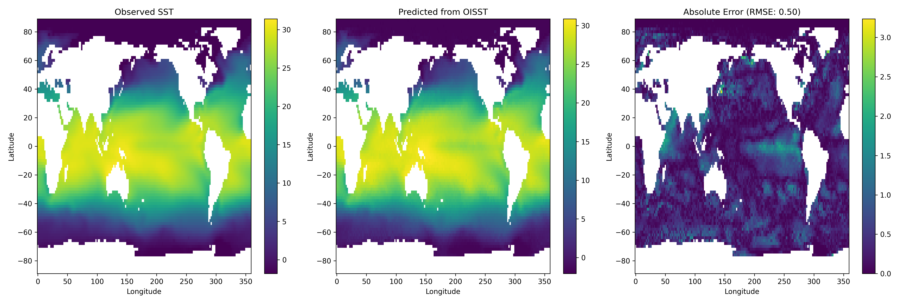

# OISST-to-ERSSTv5 

This repo uses near-real-time OISST data (released daily with a 1–2 day delay) to predict ERSSTv5 SST values (released monthly with ~4 days later). 

The ERSSTv5 data is useful as input to GISTEMP for generating the land–ocean temperature index.

* Results for march 2025 (trained on 2000 - 2024 data) 

